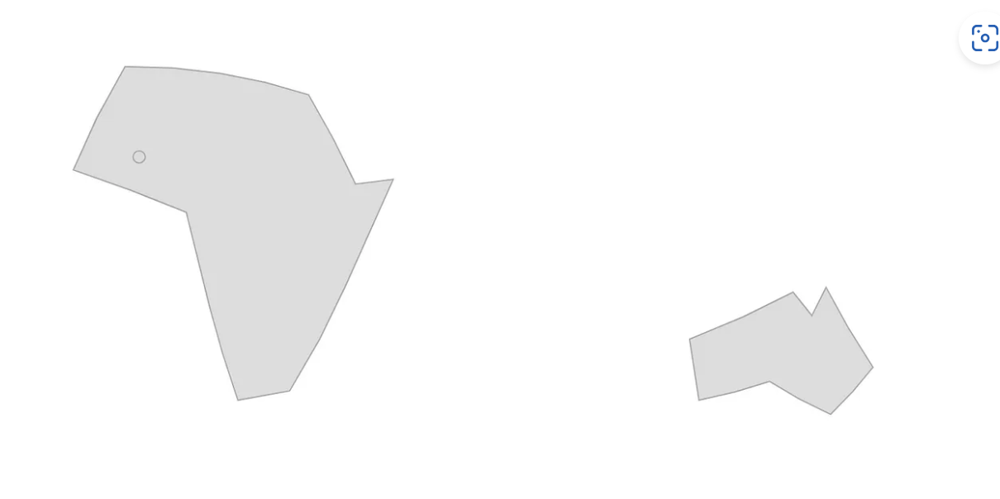
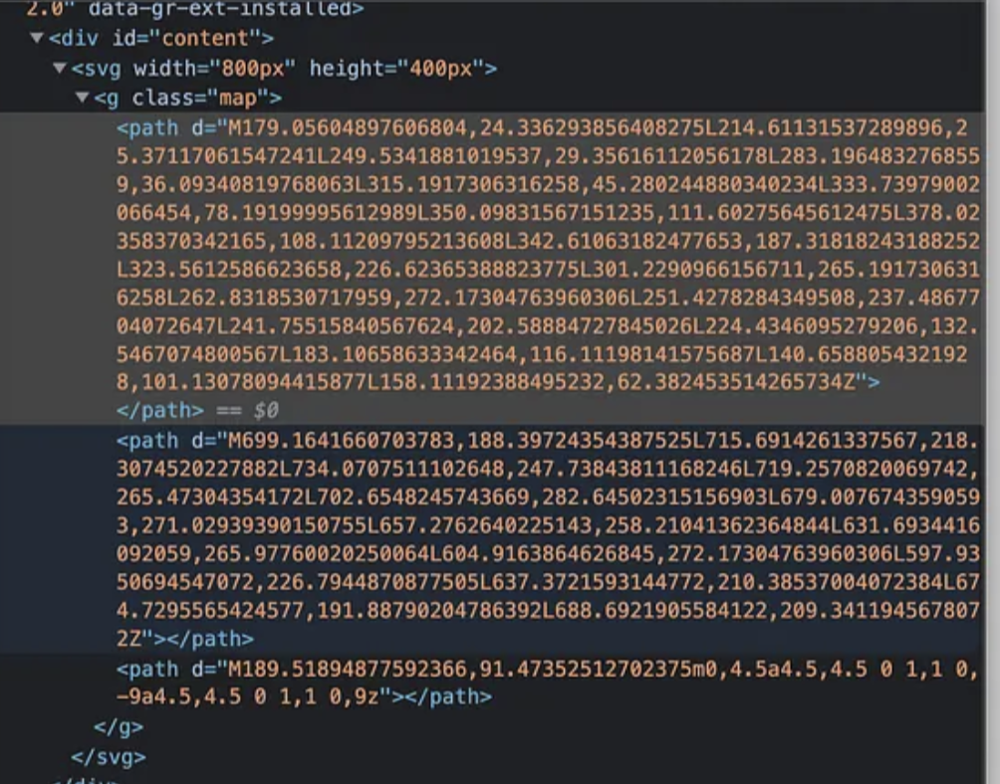

# Demo D3.js US Map

This is a recreation from this blog: https://medium.com/@nithy.official95/creating-maps-using-d3-js-in-react-f42b8a292580

# GeoJSOn

```JSON
{
  "type": "FeatureCollection",
  "features": [
    {
      "type": "Feature",
      "properties": {
        "name": "Africa"
      },
      "geometry": {
        "type": "Polygon",
        "coordinates": [[[-6, 36], [33, 30], ... , [-6, 36]]]
      }
    },
    {
      "type": "Feature",
      "properties": {
        "name": "Australia"
      },
      "geometry": {
        "type": "Polygon",
        "coordinates": [[[143, -11], [153, -28], ... , [143, -11]]]
      }
    }
  ]
}
```

FeatureCollection: Africa, Australia

Each Feature: geometry, properties (name, id, GDP, etc)

# Projection

A projection function takes a longitude and latitude coordinate (in the form of an array [lon, lat]) and transforms it into an x and y coordinate. D3 provides a large number of projection functions.

There are many projection functions in d3; two commonly used projections for creating the maps we’re accustomed to: Albers and Mercator. Albers projection is better for preserving the area, while Mercator projection is better for preserving shape.

```javascript
function projection( lonLat ) {
    let x = ... // some formula here to calculate x
    let y = ... // some formula here to calculate y
    return [x, y];
}
projection( [-3.0026, 16.7666] )
// returns [474.7594743879618, 220.7367625635119]

// in d3
let projection = d3.geoAlbers();
projection( [-3.0026, 16.7666] )
// returns [474.7594743879618, 220.7367625635119]
```

# Geographic Path Geneartor

A geographic path generator is a function that transforms GeoJSON into an SVG path string (or into canvas element calls).

```javascript
geoGenerator(geoJson);
// e.g. returns a SVG path string "M464.01,154.09L491.15,154.88 ... L448.03,183.13Z"

// in d3
let projection = d3.geoAlbers();
let geoGenerator = d3.geoPath()
  .projection(projection);
```
You can use the generator to create either SVG or canvas maps. *SVG maps are easier to implement, especially for user interaction*, as they allow you to add event handlers and hover states. Canvas maps require more work, but they are typically faster to render and more memory efficient.


# Putting it together

1. Join a GeoJSON features array to SVG path elements.
2. Update each path element’s d attribute using the geographic path generator.

Below is an example of rendering a map with both polygons and a circle.
```javascript
let geoJson = {
  "type": "FeatureCollection",
  "features": [
    {
      "type": "Feature",
      "properties": {
        "name": "Africa"
      },
      "geometry": {
        "type": "Polygon",
        "coordinates": [[[-6, 36], [33, 30], ... , [-6, 36]]]
      }
    },
    {
      "type": "Feature",
      "properties": {
        "name": "Australia"
      },
      "geometry": {
        "type": "Polygon",
        "coordinates": [[[143, -11], [153, -28], ... , [143, -11]]]
      }
    },
    {
      "type": "Feature",
      "properties": {
        "name": "Timbuktu"
      },
      "geometry": {
        "type": "Point",
        "coordinates": [-3.0026, 16.7666]
      }
    }
  ]
}

let projection = d3.geoEquirectangular();

let geoGenerator = d3.geoPath()
  .projection(projection);

// Join the FeatureCollection's features array to path elements
let u = d3.select('#content g.map') // <g> with class .map has been created beforehand
  .selectAll('path')
  .data(geojson.features) // map features into paths
  .join('path')
  .attr('d', geoGenerator); // update 
```
</img>
</img>

